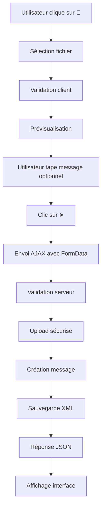

# 📎 Guide d'envoi de fichiers - WhatsApp Web Clone

## 🎯 Vue d'ensemble

Cette application prend maintenant en charge l'envoi et la réception de fichiers dans les conversations privées et de groupe. Les utilisateurs peuvent partager des images, documents, vidéos, audio et fichiers compressés de manière sécurisée.

## 🛠️ Architecture implémentée

### 1. **Backend (PHP)**

#### **Services**
- **`FileUploadService`** : Gestion complète de l'upload sécurisé
  - Validation des types MIME
  - Vérification de la taille (max 10MB)
  - Génération de noms uniques
  - Protection contre les attaques

#### **Modèles**
- **`Message`** étendu avec :
  - `filePath` : Chemin du fichier
  - `fileName` : Nom original
  - `fileSize` : Taille en bytes
  - Méthodes : `isImage()`, `getFormattedFileSize()`, `getFileExtension()`

#### **Repositories**
- **`MessageRepository`** mis à jour pour gérer les champs de fichiers
- Sauvegarde en XML avec validation XSD

#### **Endpoints**
- **`ajax.php`** : Actions `upload_file`, `send_message`, `send_group_message`
- **`download.php`** : Téléchargement sécurisé avec vérification des permissions

### 2. **Frontend (JavaScript)**

#### **Interface utilisateur**
- Bouton de sélection de fichier (📎)
- Prévisualisation avec icônes et taille
- Validation côté client
- Indicateur de progression

#### **Affichage des messages**
- Prévisualisation des images
- Informations détaillées des fichiers
- Boutons de téléchargement
- Icônes selon le type de fichier

### 3. **Sécurité**

#### **Validation multi-niveaux**
1. **Client** : Taille et type avant envoi
2. **Serveur** : Validation complète avec `FileUploadService`
3. **Contenu** : Vérification MIME réelle et scan anti-malware

#### **Protection du répertoire**
- `.htaccess` : Blocage des scripts PHP
- `index.php` : Redirection si accès direct
- Noms de fichiers sécurisés

## 📋 Types de fichiers supportés

### **Images**
- JPEG, JPG, PNG, GIF, BMP, WebP, SVG
- Prévisualisation automatique
- Ouverture en nouvelle fenêtre

### **Documents**
- PDF, DOC, DOCX, XLS, XLSX, PPT, PPTX
- TXT, RTF
- Icônes spécifiques

### **Médias**
- MP3 (audio)
- MP4, AVI, MOV, WMV (vidéo)

### **Archives**
- ZIP, RAR

## 🚀 Utilisation

### 1. **Envoyer un fichier**
```javascript
// L'utilisateur clique sur le bouton 📎
// Sélectionne un fichier
// Prévisualisation s'affiche
// Peut ajouter un message texte (optionnel)
// Clique sur ➤ pour envoyer
```

### 2. **Recevoir un fichier**
```php
// Le message s'affiche avec :
// - Icône du type de fichier
// - Nom et taille
// - Prévisualisation pour les images
// - Bouton "📥 Télécharger"
```

### 3. **Télécharger un fichier**
```php
// Clic sur "📥 Télécharger"
// → Redirection vers download.php
// → Vérification des permissions
// → Téléchargement sécurisé
```

## 🔧 Configuration technique

### **Limites**
- Taille maximale : **10MB** par fichier
- Types MIME : Validés côté serveur
- Stockage : Répertoire `public/uploads/`

### **Nommage des fichiers**
```php
// Format : {userPrefix}_{timestamp}_{random}_{originalName}
// Exemple : user1_16_8f7a3b2c_document.pdf
```

### **Base de données XML**
```xml
<message id="msg_123">
    <content>Document important</content>
    <type>file</type>
    <from_user>user1</from_user>
    <to_user>user2</to_user>
    <file_path>uploads/user1_16_8f7a3b2c_document.pdf</file_path>
    <file_name>document.pdf</file_name>
    <file_size>1048576</file_size>
</message>
```

## 🧪 Tests et validation

### **Exécuter les tests**
```bash
php test_file_upload.php
```

### **Tests couverts**
- ✅ Validation des extensions
- ✅ Vérification des tailles
- ✅ Structure XML
- ✅ Sécurité du répertoire
- ✅ Formatage des tailles
- ✅ Icônes de fichiers
- ✅ Endpoint de téléchargement

## 🔐 Sécurité implémentée

### **Validation des fichiers**
```php
// 1. Vérification de l'extension
// 2. Validation du type MIME
// 3. Vérification de la taille
// 4. Scan du contenu
// 5. Détection de code malveillant
```

### **Protection du répertoire**
```apache
# .htaccess
<Files "*.php">
    Order Deny,Allow
    Deny from all
</Files>
```

### **Permissions de téléchargement**
```php
// Messages privés : expéditeur + destinataire + contact existant
// Messages de groupe : membres du groupe uniquement
```

## 🎨 Interface utilisateur

### **Bouton d'envoi**
- Icône : 📎
- Position : À gauche de l'input texte
- Couleur : Gris (#667781)

### **Prévisualisation**
- Icône selon le type
- Nom du fichier
- Taille formatée
- Bouton de suppression

### **Affichage des messages**
- Images : Prévisualisation 250x200px
- Fichiers : Boîte avec icône, nom, taille
- Texte : Optionnel avec le fichier

## 🔄 Flux d'envoi



## 📁 Structure des fichiers

```
public/
├── uploads/               # Répertoire des fichiers
│   ├── .htaccess         # Protection Apache
│   └── index.php         # Blocage accès direct
├── download.php          # Téléchargement sécurisé
├── ajax.php              # Actions AJAX (modifié)
├── chat.php              # Interface chat (modifié)
└── assets/
    └── js/
        └── app.js         # JavaScript (modifié)

src/
├── Services/
│   └── FileUploadService.php  # Nouveau service
├── Models/
│   └── Message.php            # Modèle étendu
└── Repositories/
    └── MessageRepository.php  # Repository mis à jour

schemas/
└── whatsapp_data.xsd     # Schéma étendu
```

## 🏃‍♂️ Démarrage rapide

1. **Lancer l'application**
   ```bash
   php start_app.php
   ```

2. **Se connecter**
   - Aller sur http://localhost:8080
   - Se connecter avec un utilisateur existant

3. **Tester l'envoi**
   - Ouvrir une conversation
   - Cliquer sur 📎
   - Sélectionner une image ou document
   - Ajouter un message (optionnel)
   - Envoyer

4. **Tester le téléchargement**
   - Cliquer sur "📥 Télécharger"
   - Le fichier se télécharge

## 🐛 Dépannage

### **Erreurs courantes**

1. **"Fichier trop volumineux"**
   - Vérifier la limite de 10MB
   - Ajuster `upload_max_filesize` en PHP

2. **"Type de fichier non autorisé"**
   - Vérifier les extensions autorisées
   - Contrôler le type MIME

3. **"Erreur d'upload"**
   - Vérifier les permissions du répertoire
   - Contrôler l'espace disque

4. **"Accès non autorisé"**
   - Vérifier la session utilisateur
   - Contrôler les permissions du message

## 📊 Monitoring

### **Logs**
- Uploads : `logs/app.log`
- Téléchargements : `logs/app.log`
- Erreurs : `logs/app.log`

### **Métriques**
- Taille des fichiers uploadés
- Types de fichiers populaires
- Erreurs d'upload

## 🔮 Améliorations futures

- [ ] Scan antivirus intégré
- [ ] Prévisualisation des vidéos
- [ ] Compression d'images
- [ ] Nettoyage automatique des fichiers anciens
- [ ] Support du drag & drop
- [ ] Indicateur de progression d'upload
- [ ] Historique des téléchargements

---

**✅ Implémentation terminée avec succès !**

Les utilisateurs peuvent maintenant envoyer et recevoir des fichiers de manière sécurisée dans toutes les conversations. 